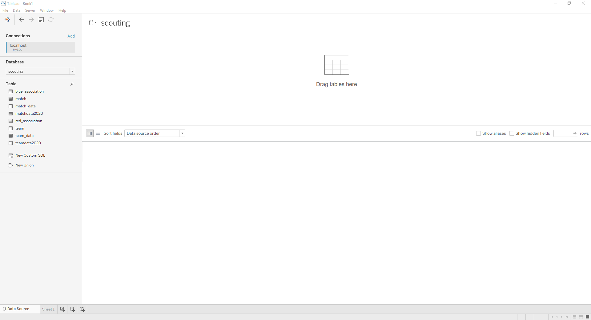
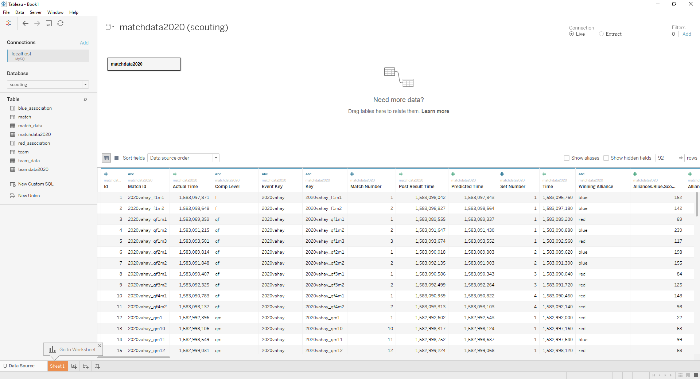

# scouting-data-ingest
Ingest scouting data from TBA and scouts and transfer it to Tableau and other visualizations

## Set Up

Firstly, clone this project with: 

```
git clone https://github.com/team4099/scouting-data-ingest.git

```

If you're using Github Desktop, hit the green button on the github page that says Code. Click the open in Github desktop link, and then clone.

This will create a folder with the Data Ingest App inside. 

Open up Command Line/Terminal. Using the below commands, get to the scouting-data-ingest folder.

- ``cd`` will move into a folder that exists in the current folder
- ``cd ..`` will move one folder up
- ``dir`` on Windows and ``ls`` on Mac will show whats in your current folder

If you do not have python installed, install it [here](https://www.python.org/downloads/). Make sure to choose version 3.8.6.

Make a python venv with:

```
python -m venv ./venv
```

Install needed packages with:

```
pip install -r requirements.txt
```

### MySQL Setup

Now open the MySQL Shell application by opening terminal and typing ```mysqlsh```. 

To connect your database type:
```\connect --mysql user@localhost``` replacing user with your username. Use "root" as your username if you did not create another user.
Enter your password when prompted.

Type:
```\sql``` to enter SQL command mode

Type: 
``CREATE DATABASE scouting;`` to create the needed database.

## Configuration

Create a new folder in the directory called config

Inside this folder you should have 2 files: config.json and a google service account credentials file

Your config file should look like this:

```json
{
  "TBA-Key": "[Include your TBA API key here]",
  "Year":"2020",
  "Google-Credentials": "[Include the name of your google service account credentials file here]",
  "Spreadsheet": "[Include the name of the spreadsheet to use here]",
  "Database User": "[User]",
  "Database Password": "[Password]",
  "Event": "[Include the current event here]"
}
```
### TBA

Get a TBA API Key by making an account [here](https://www.thebluealliance.com/account) and then creating an TBA API Read Key. The description can be anything. Paste the key into your config file. 

### MySQL

Database user and password should be the user and password for MySQL that you configured. If you did not configure a user, Database user should be root, and the password should be the password you entered.

### Spreadsheet

For 2020, the Spreadsheet value should be set to "Scouting Data Collection (Responses)", without the quotes.

### Google Service Account Credentials File

DM me (ksam) for a Google Credentials key file. Download the file and place it in your config folder. Copy the **name** of the file with the file extension and paste it into the Google Credentials value for config.json.

### Event

For now, set the Event field to "vahay".

## Running the Program

If you have a Python IDE, just run DataInput.py in the IDE.

If you do not have a Python IDE, open Command Line/Terminal and navigate back to the scouting-data-ingest folder. 
Type ``python -m main``

## Tableau Setup

To properly use the data, you need to do a bit of setting up in Tableau.

Open up Tableau. On the blue Connect bar on the left, select MySQL under the To A Server section.

In the MySQL Dialog, Server should be "localhost" (without the quotes), Database should be "scouting", and fill in your user name and password. Click Sign in.

You will now see this. 


Drag matchdata2020 over to the workspace. Click Update Now to see the data.


Now we need to link Team Data. Drag the teamdata2020 table **to the right of the Union in the workspace**. Select Key for the matchdata2020 on the left in the new dialog, and the Match Key field on the right for teamdata2020. Close the dialog.

Congrats! You've finished setup. Go to your worksheet using the navigation bar at the bottom, and have some fun!

Do know that this is under development and as such data and processes may change. Stay up to date by reviewing this README and watching for new updates.

## Getting New Changes
Open command line/Terminal and get to the scouting-data-ingest folder.
If you use git on the command line/Terminal, type ``git pull``. You are done and can run the new changes.
If you use GitHub Desktop, click the Fetch Origin button at the top.